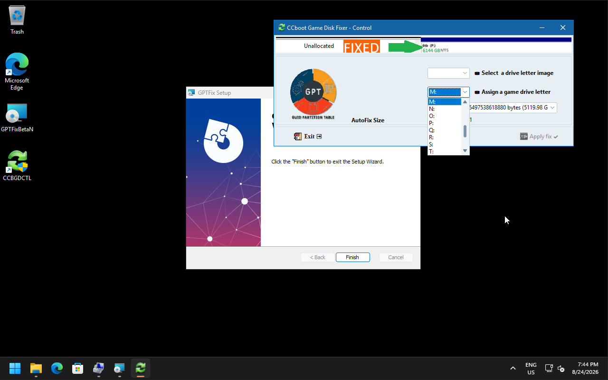

# CCBoot Classic GPT Repair Tool — Configuration Manual ⚙️

This manual explains how to configure the utility for environments running **Windows 25H2 or later**, where CCBoot Classic encounters issues with GPT backup header validation on disks larger than **2TB** (since MBR cannot be used for high-capacity drives).

---

## 🔍 The Problem

Starting with **Windows 25H2**, CCBoot Classic fails to properly pass or verify the backup GPT header for game disks exceeding 2TB, as the legacy software cannot utilize MBR limits. 

This utility provides a background service that automatically fixes the GPT structure during system startup, keeping your large storage arrays accessible.

---

## 🛠️ Configuration Guide

Because diskless solutions like CCBoot Classic and CCU cannot dynamically prompt the service for target drive letters or specific disk selections, you must configure the tool **once** before deployment.

### Step-by-Step Setup:

1. **Run the Configurator:** Launch the configuration utility **`GDFCTL`** (run it with administrative privileges).
2. **Select Mode:** Choose **Super Mode** in the interface.
3. **Map the Disk and Letter:** 
   - Select the target game disk that requires fixing.
   - Assign the correct drive letter that matches your CCBoot/CCU environment.
4. **Save Configuration:** Apply and save your settings.

### Final Result

Once saved, the configuration is stored. After every system reboot, the background service will automatically hook into the specified disk and apply the fix at boot time, ensuring seamless operation in both **Super Mode** and standard game disk modes.
